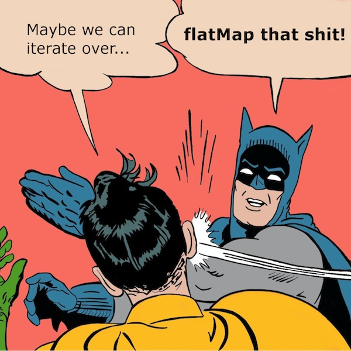

  <big><b>Lovely for-comprehensions</b></big>  
   
  Adam Rosien  
  <small>CrowdStrike</small>  
  <code>adam@rosien.net</code>  
   
  <code>@arosien #scalaio</code>

---

# 

---

# 

---

# Types are wonderful...

    !scala
    def transitionHaveFsPostOpenSnapshotState(
      input: InputMessage,
      tags: CorrelatorTagMap):
        (CorrelatorData,
          (ActorRef, CorrelatorIndex) => Unit)

---

# ... but they hide the implementation

which can be quite complicated and difficult

---

# Niiiiiice

    !scala
    for {
      response <- searchApi(RuleQuery(search)).run
      alert    <- response.fold(toFailure, toAlert)
    } yield alert

---

# `F[_]`

---

# `F[_]`

`F[_]`? What's an `F[_]`?

    !scala
    import language.higherKinds

    def doStuff[F[_], A](fa: F[A]) = ???

---

# `F[_]`

    !scala
    package scala.collection
    package immutable

    sealed abstract class List[+A] { // ... }
                             ^ ^
                             ^ ^
                             F[_]

---

# `F[_]`

`Option` is an `F[_]`:

    !scala
    package scala

    sealed abstract class Option[+A] { // ... }
                               ^ ^
                               ^ ^
                               F[_]

---

# `F[_]`

`F[_]`!!

* `List`
* `Option`
* `Future`
* `Either`?

Lots more....

---

# for-comprehensions

---

# `F[_] => F[_]`

	!scala
    scala> for {
         |   s <- Option("stuff")
         | } yield s.length
    res0: Option[Int] = Some(5)

    scala> for {
         |   x <- List(1, 2, 3)
         |   y <- List(4, 5, x)
         | } yield y + 1
    res1: List[Int] =
        List(5, 6, 2, 5, 6, 3, 5, 6, 4)

---

# As syntactic sugar

A single expression without `yield` translates to `foreach`:

	!scala
    scala> reflect.runtime.universe.reify {
         |   for {
         |     x <- Some(12)
         |   } println(x)
         | }.tree
    res2: reflect.runtime.universe.Tree =
      Some.apply(12)
        .foreach(((x) =>
          Predef.println(x)))

---

# As syntactic sugar

A single expression translates to `map`:

	!scala
    scala> reflect.runtime.universe.reify {
         |   for {
         |     x <- Some(12)
         |   } yield x + 1
         | }.tree
    res3: reflect.runtime.universe.Tree =
      Some.apply(12)
        .map(((x) =>
          x.$plus(1)))

---

# As syntactic sugar

    !scala
    scala> reflect.runtime.universe.reify {
         |   for {
         |     x <- Some(12)
         |     y <- Some(2)
         |   } yield x * y
         | }.tree
    res4: reflect.runtime.universe.Tree =
      Some.apply(12)
        .flatMap(((x) =>
          Some.apply(2)
            .map(((y) =>
              x.$times(y)))))

Multiple expressions translate to `flatMap`, with the last one translated to `map`.

---

# As syntactic sugar

    !scala
    scala> reflect.runtime.universe.reify {
         |   for {
         |     x <- Some(12) if x < 10
         |   } yield x + 1
         | }.tree
    res5: reflect.runtime.universe.Tree =
      Some.apply(12)
        .withFilter(((x) =>
          x.$less(10)))
          .map(((x) =>
            x.$plus(1)))

Conditionals are translated to `filter` or `withFilter`.

---

# As syntactic sugar

    !scala
    scala> reflect.runtime.universe.reify {
         |   for {
         |     x <- Some(12)
         |     y = x + 1
         |   } yield y
         | }.tree
    res6: reflect.runtime.universe.Tree =
      Some.apply(12).map(((x) => {
        val y = x.$plus(1);
        Tuple2.apply(x, y)
      })).map(((x$1) => x$1: @unchecked match {
        case Tuple2((x @ _), (y @ _)) => y
      }))

Intermediate values are translated to two `map`s with a tuple.

---

# Rules & Techniques

---

# Avoid "complexity-braces"

	!scala
    scala> def uggslies = {
         |   val thing = ???
         |   val anotherThingThatDoesStuff = ???
         |   // DANGER COMPLEX STUFFZ!!
         |   ???
         | }

"complexity-braces" are a code smell. Braces contain statements with arbitrary side-effects.

---

# Avoid "complexity-braces"

Expressions don't need them. Expressions produce _values_.

    !scala
    def thePrecious: MagicEffect[Baz] =
      for {
        foo <- magicFoo
        bar <- magicBar(foo)
      } baz(bar)
    }

---

# RHS must have same shape

	!scala
    scala> illTyped("""
         |   for {
         |     x <- Some(12)   // Option[Int]
         |     y <- List(2, 4) // List[Int]
         |   } yield x * y
         | """)
    res7: String =
    type mismatch;
     found   : List[Int]
     required: Option[?]

Danger! `scala.Predef` imports confusing implicit conversions like `Option => Iterable`!

---

# RHS must have same shape

	!scala
    scala> for {
         |   x <- Some(12).toList
         |   y <- List(2, 4)
         | } yield x * y
    res8: List[Int] = List(24, 48)

---

# `traverse`

    !scala
    F[A]    => (A => G[B])      => G[F[B]]

    e.g.,

    List[A] => (A => Future[B]) => Future[List[B]]

---

# `traverse`

	!scala
    scala> illTyped("""
         | val xs = List(1, 2, 3)
         | def doWork(x: Int): Future[Int] =
         |   Future.successful(x)
         | val work: Future[List[Int]] =
         |   for {
         |     x <- xs        // List[Int]
         |     y <- doWork(x) // Future[Int]
         |   } yield y
         | """)
    res9: String = 
    type mismatch;
     found   : scala.concurrent.Future[Int]
     required: scala.collection.GenTraversableOnce[?]

---

# `traverse`

	!scala
    scala> def doWork(x: Int): Future[Int] =
         |   Future.successful(x)
    doWork: (x: Int)scala.concurrent.Future[Int]

    scala> val work: Future[List[Int]] =
         |   Future.traverse(List(1, 2, 3))(doWork)
    work: scala.concurrent.Future[List[Int]] = scala.concurrent.impl.Promise$DefaultPromise@34d8aa71

    scala> work.value
    res10: Option[scala.util.Try[List[Int]]] = Some(Success(List(1, 2, 3)))

---

# `sequence`

    !scala
    F[G[A]] => G[F[A]]

    e.g.,

    List[Future[A]] => Future[List[A]]

---

# Avoid `match`

`match`, aka deconstruction, is less powerful:

	!scala
    scala> def zibby(z: Option[Foo]): String =
         |   z match {
         |     case Some(foo) =>
         |       foo.bar match {
         |         case Some(bar) => if (bar.sup.isDefined) "whee" else "boo"
         |         case None => ""
         |       }
         |     case None => ""
         |   }
    zibby: (z: Option[Foo])String

---

# Avoid `match`

	!scala
    scala> def zibby2(z: Option[Foo]): Option[String] =
         |   for {
         |     foo <- z
         |     bar <- foo.bar
         |   } yield
               if (bar.sup.isDefined) "whee"
               else "boo"
    zibby2: (z: Option[Foo])Option[String]

---

# Inline value declarations

	!scala
    scala> val classifications =
      Map.empty[String, Map[String, String]]
    scala> val sha256Classifications =
      classifications.get("msg.sha256")
    scala> val customerResult =
      sha256Classifications.flatMap(_.get("msg.cid"))
    scala> val globalResult =
      sha256Classifications.flatMap(_.get("GlobalColumnName"))
    scala> val finalResult: Option[String] =
      customerResult orElse globalResult
    finalResult: Option[String] = None

---

# Inline value declarations

	!scala
    scala> val finalResult2: Option[String] =
     |   for {
     |     sha256Classifications <- classifications.get("msg.sha256")
     |     cid = sha256Classifications.get("msg.cid")
     |     global = sha256Classifications.get("GlobalColumnName")
     |     r <- cid orElse global
     |   } yield r
    finalResult2: Option[String] = None

---

# Abstracting over `F[_]`

	!scala
    scala> for {
         |   i <- Option(1)
         | } yield i + 1
    res12: Option[Int] = Some(2)

---

# Abstracting over `F[_]`

    !scala
    scala> for {
         |   i <- List(1, 2, 3)
         | } yield i + 1
    res13: List[Int] = List(2, 3, 4)

---

# Abstracting over `F[_]`

    !scala
    scala> for {
         |   i <- Future.successful(1)
         | } yield i + 1
    res14: scala.concurrent.Future[Int] = scala.concurrent.impl.Promise$DefaultPromise@8392122

---

# Abstracting over `F[_]`

	!scala
    scala> def plusOne[F[_] : Functor]
             (fi: F[Int]): F[Int] =
         |   for {
         |     i <- fi
         |   } yield i + 1
    warning: there were 1 feature warning(s); re-run with -feature for details
    plusOne: [F[_]](fi: F[Int])(implicit evidence$1: scalaz.Functor[F])F[Int]

    scala> plusOne(Option(1))
    res15: Option[Int] = Some(2)

    scala> plusOne(List(1, 2, 3))
    res16: List[Int] = List(2, 3, 4)

    scala> Await.result(
         |   plusOne(Future.successful(1)),
         |   1.second)
    res17: Int = 2

---

# Abstracting over `F[_]`

	!scala
    scala> val plusOne2: Int => Int = _ + 1
    plusOne2: Int => Int = <function1>

    scala> val optionPlusOne:
      Option[Int] => Option[Int] =
         |   Functor[Option].lift(plusOne2)
    optionPlusOne: Option[Int] => Option[Int] = <function1>

    scala> optionPlusOne(Some(41))
    res18: Option[Int] = Some(42)

We can separate our pure functions from our effects!

---

# In summary

---

# In summary

for-comprehension = just good refactoring

* Know your desugaring
* Avoid complexity-braces, `match`
* Use inline values to clean up your for-comps
* Ugly code can be improved!

Thank you!

Adam Rosien / `adam@rosien.net` / `@arosien #scalaio`
